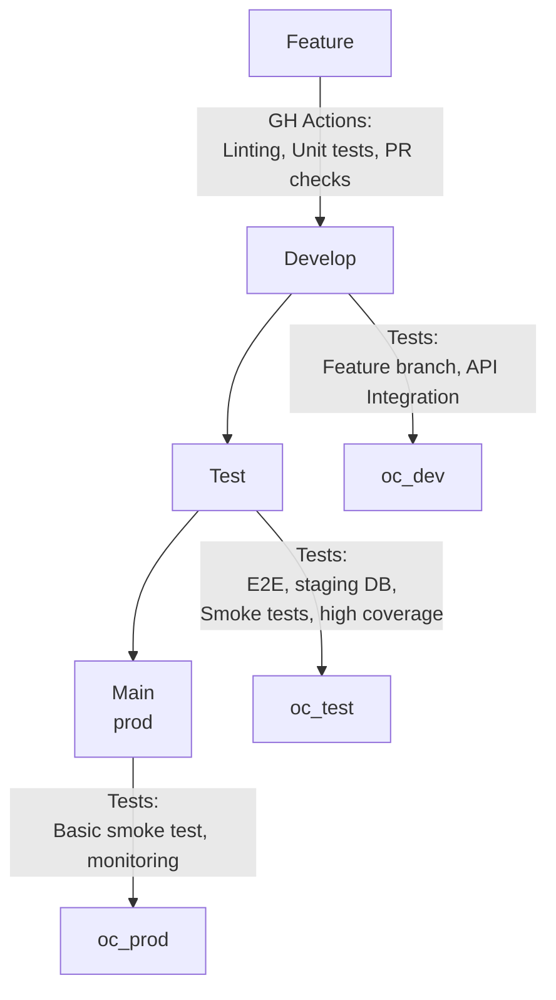

## Contributing 
---
## How to contribute
Government employees, public and members of the private sector are encouraged to contribute to the repository by **forking and submitting a pull request**. 

(If you are new to GitHub, you might start with a [basic tutorial](https://help.github.com/articles/set-up-git) and  check out a more detailed guide to [pull requests](https://help.github.com/articles/using-pull-requests/).)

Pull requests will be evaluated by the repository guardians on a schedule and if deemed beneficial will be committed to the main.

All contributors retain the original copyright to their stuff, but by contributing to this project, you grant a world-wide, royalty-free, perpetual, irrevocable, non-exclusive, transferable license to all users **under the terms of the license under which this project is distributed.**

## Proposed Branching Strategy

Our branching is as follows:

feature --> develop  --> test --> main

### Creating a new feature 

1. Ensure you have a ticket assigned
1. Create a branch off of develop
1. Make small commits, ensure your feature is accompanied by tests

### Merging into develop

1. When you are satisfied with your local feature branch, it's time to merge into develop.
1. Push your code to github, this will trigger our testing pipeline
1. With all tests passed, create a PR. Once approved it will be merged into develop.
1. After the changes are merged in, our development namespace on openshift will automatically re-deploy with the newly merged features.

